# Newsbot — End-to-End Flow

This document illustrates how Newsbot discovers, analyzes, and publishes security news content. The diagram covers trigger mechanisms, configuration loading, GitHub repository search, RSS feed aggregation, article deduplication, LLM-based assessment, report generation, and documentation publishing.

```mermaid
flowchart TD
    %% ── Trigger ──────────────────────────────────────────────
    subgraph Triggers["Trigger Mechanisms"]
        T1["⏰ Cron Schedule\n(daily 9 AM UTC)"]
        T2["▶️ Manual Dispatch\n(workflow_dispatch)"]
        T3["🖥️ Local Execution\n(run_local.sh / CLI)"]
    end

    T1 --> INIT
    T2 --> INIT
    T3 --> INIT

    %% ── Initialization ──────────────────────────────────────
    subgraph Initialization["Initialization"]
        INIT["Parse CLI Arguments\n(--config, --output-dir,\n--publish-docs, --verbose)"]
        INIT --> VALIDATE_TOKEN{"GITHUB_TOKEN\nset?"}
        VALIDATE_TOKEN -->|No & required| EXIT_TOKEN["Exit with error"]
        VALIDATE_TOKEN -->|Yes or not required| LOAD_CONFIG["Load config.json"]
        LOAD_CONFIG --> LOAD_KEYWORDS["Load search_keywords.json"]
        LOAD_CONFIG --> LOAD_TOPICS["Load github_topics.json"]
        LOAD_CONFIG --> LOAD_FEEDS["Load rss_feeds.json"]
        LOAD_KEYWORDS --> INIT_BOT["Initialize NewsBot"]
        LOAD_TOPICS --> INIT_BOT
        LOAD_FEEDS --> INIT_BOT
        INIT_BOT --> INIT_RSS{"RSS enabled?"}
        INIT_RSS -->|Yes| INIT_RSS_MGR["Init RSSFeedManager\n(timeout, cache, rate limit)"]
        INIT_RSS -->|No| INIT_LLM
        INIT_RSS_MGR --> INIT_LLM["Init OpenAI Client\n(GitHub Models endpoint)"]
    end

    %% ── Aggregation Entry ────────────────────────────────────
    INIT_LLM --> AGGREGATE["aggregate_news()"]

    %% ── Article Deduplication ────────────────────────────────
    subgraph Dedup["Article Deduplication"]
        AGGREGATE --> DEDUP_CHECK{"skip_analyzed\nenabled?"}
        DEDUP_CHECK -->|Yes| LOAD_CACHE["load_analyzed_articles()\nScan results_*.json &\nrejected_*.json in outputs/"]
        LOAD_CACHE --> BUILD_ID_SET["Build analyzed_ids set\n(article URLs)"]
        DEDUP_CHECK -->|No| SEARCH_DISPATCH
        BUILD_ID_SET --> SEARCH_DISPATCH
    end

    %% ── Source Search Dispatch ───────────────────────────────
    SEARCH_DISPATCH{"Dispatch searches"}
    SEARCH_DISPATCH --> GH_CHECK{"GitHub\nenabled?"}
    SEARCH_DISPATCH --> RSS_CHECK{"RSS\nenabled?"}

    %% ── GitHub Repository Search ─────────────────────────────
    subgraph GitHubSearch["GitHub Repository Search"]
        GH_CHECK -->|Yes| GH_QUERY["For each topic:\nSearch GitHub API\n(topic + pushed date)"]
        GH_CHECK -->|No| GH_SKIP["Skip GitHub search"]
        GH_QUERY --> GH_AI_FILTER{"Description contains\nAI keywords?\n(ai, llm, ml, gpt,\nautomation, automated)"}
        GH_AI_FILTER -->|Yes| GH_RESULT["Create GitHubResult"]
        GH_AI_FILTER -->|No| GH_REJECT["Add to rejected\n(missing_ai_keywords)"]
        GH_RESULT --> GH_DEDUP{"Dedup enabled\n& in analyzed_ids?"}
        GH_DEDUP -->|Yes| GH_SKIP_DUP["Skip duplicate"]
        GH_DEDUP -->|No| GH_ADD["Add to all_results"]
    end

    %% ── RSS Feed Search ──────────────────────────────────────
    subgraph RSSSearch["RSS Feed Search"]
        RSS_CHECK -->|Yes| RSS_FETCH["Fetch all feeds\n(RSSFeedManager)"]
        RSS_CHECK -->|No| RSS_SKIP["Skip RSS search"]

        subgraph FeedFetch["Feed Fetching & Caching"]
            RSS_FETCH --> FEED_LOOP{"For each\nconfigured feed"}
            FEED_LOOP --> CACHE_CHECK{"Cache valid?"}
            CACHE_CHECK -->|Yes| CACHE_HIT["Use cached entries"]
            CACHE_CHECK -->|No| RATE_LIMIT["Apply rate limit delay"]
            RATE_LIMIT --> PARSE_FEED["feedparser:\nParse feed URL"]
            PARSE_FEED --> EXTRACT_META["Extract entries:\ntitle, link, summary,\ndate, tags, author"]
            EXTRACT_META --> UPDATE_CACHE["Cache entries\nwith timestamp"]
            CACHE_HIT --> COLLECT_ENTRIES["Collect all entries"]
            UPDATE_CACHE --> COLLECT_ENTRIES
        end

        COLLECT_ENTRIES --> DATE_FILTER["Filter by date\n(max_age_days)"]

        subgraph PreLLMDedup["Pre-LLM Deduplication"]
            DATE_FILTER --> RSS_DEDUP{"analyzed_ids\navailable?"}
            RSS_DEDUP -->|Yes| RSS_SKIP_KNOWN["Skip entries with\nURLs in analyzed_ids"]
            RSS_DEDUP -->|No| TITLE_FILTER_CHECK
            RSS_SKIP_KNOWN --> TITLE_FILTER_CHECK
        end

        subgraph TitleFilter["Title Relevance Filtering"]
            TITLE_FILTER_CHECK{"LLM title\nfilter enabled?"}
            TITLE_FILTER_CHECK -->|Yes| LLM_TITLE_FILTER["filter_titles_by_relevance()\nLLM selects relevant\ntitle indices"]
            LLM_TITLE_FILTER --> TITLE_RESULT{"Relevant\ntitles found?"}
            TITLE_RESULT -->|Yes| KEEP_RELEVANT["Keep relevant entries"]
            TITLE_RESULT -->|No| KW_FALLBACK_CHECK{"Keyword fallback\nenabled?"}
            KW_FALLBACK_CHECK -->|Yes| KW_FILTER["filter_by_keywords()\n(min_keyword_matches)"]
            KW_FALLBACK_CHECK -->|No| EMPTY_SET["Empty result set"]
            TITLE_FILTER_CHECK -->|No| KW_FILTER
        end

        KEEP_RELEVANT --> BUILD_RSS
        KW_FILTER --> BUILD_RSS
        EMPTY_SET --> BUILD_RSS

        subgraph DomainAssessment["Domain Credibility Assessment"]
            BUILD_RSS["Build RSSResult objects"] --> ASSESS_DOMAIN["assess_source_credibility()\nCheck URL domain against\ncredible sources lists"]
            ASSESS_DOMAIN --> DOMAIN_RESULT["Assign credibility:\nhigh / medium / low"]
        end

        subgraph LLMAssessment["LLM Article Assessment"]
            DOMAIN_RESULT --> LLM_CHECK{"LLM assessment\nenabled?"}
            LLM_CHECK -->|No| ACCEPT_ALL["Accept all\nfiltered entries"]
            LLM_CHECK -->|Yes| PREP_BATCH["Prepare articles\nfor batch assessment"]
            PREP_BATCH --> BATCH_LOOP["assess_articles_batch()\nProcess in batches\n(default batch_size=5)"]

            subgraph BatchProcess["Batch Processing"]
                BATCH_LOOP --> BATCH_SIZE_CHECK{"Batch has\n1 article?"}
                BATCH_SIZE_CHECK -->|Yes| SINGLE_ASSESS["Individual assessment:\nassess_article_applicability()\nassess_article_credibility()"]
                BATCH_SIZE_CHECK -->|No| MULTI_ASSESS["_assess_batch_internal()\nSingle LLM call for\nmultiple articles"]
                MULTI_ASSESS --> BATCH_PARSE{"Response\nvalid?"}
                BATCH_PARSE -->|Yes| BATCH_RESULTS["Return batch results"]
                BATCH_PARSE -->|No| FALLBACK["_fallback_individual_assessment()\nAssess each article\nindividually"]
                SINGLE_ASSESS --> BATCH_RESULTS
                FALLBACK --> BATCH_RESULTS
            end

            BATCH_RESULTS --> APPLY_SCORES["Apply scores to\nRSSResult objects"]

            subgraph Filtering["Threshold Filtering"]
                APPLY_SCORES --> APP_THRESHOLD{"Applicability score\n>= threshold?\n(default 0.6)"}
                APP_THRESHOLD -->|No| REJECT_APP["Reject:\nllm_applicability_below_threshold"]
                APP_THRESHOLD -->|Yes| CRED_THRESHOLD{"Credibility score\n>= threshold?\n(default 0.5)"}
                CRED_THRESHOLD -->|No| REJECT_CRED["Reject:\nllm_credibility_below_threshold"]
                CRED_THRESHOLD -->|Yes| INCLUDE["Include in\nRSS results"]
            end
        end
    end

    %% ── Result Aggregation ───────────────────────────────────
    GH_ADD --> COMBINE["Combine all_results\n(GitHub + RSS)"]
    GH_SKIP --> COMBINE
    GH_SKIP_DUP --> COMBINE
    RSS_SKIP --> COMBINE
    ACCEPT_ALL --> COMBINE
    INCLUDE --> COMBINE
    REJECT_APP --> REJECTED["Collect rejected_results"]
    REJECT_CRED --> REJECTED
    GH_REJECT --> REJECTED

    %% ── Report Generation ────────────────────────────────────
    subgraph ReportGen["Report Generation"]
        COMBINE --> ENSURE_DIR["Create outputs/ directory"]
        ENSURE_DIR --> GEN_TS["Generate timestamp\n(YYYYMMDD_HHMMSS)"]
        GEN_TS --> GEN_MD["generate_report()\nMarkdown report\n(report_TIMESTAMP.md)"]
        GEN_TS --> GEN_JSON["save_json_results()\nJSON results\n(results_TIMESTAMP.json)"]
        GEN_TS --> GEN_REJECTED["save_json_results()\nRejected articles\n(rejected_TIMESTAMP.json)"]
    end

    %% ── Docs Publishing ──────────────────────────────────────
    subgraph DocsPublish["Docs Publishing (GitHub Pages)"]
        GEN_MD --> DOCS_CHECK{"publish_docs\nenabled?"}
        GEN_JSON --> DOCS_CHECK
        GEN_REJECTED --> DOCS_CHECK
        DOCS_CHECK -->|No| DONE
        DOCS_CHECK -->|Yes| INIT_DOCS["initialize_docs_directory()\nCreate docs/, .nojekyll,\nREADME.md"]
        INIT_DOCS --> PUB_STRUCT["publish_structured_docs()"]

        subgraph StructuredDocs["Structured Docs Generation"]
            PUB_STRUCT --> PUB_REPOS["Generate repositories.md\n(table of GitHub repos\nsorted by stars)"]
            PUB_STRUCT --> PUB_ARTICLES["Generate article pages\n(docs/articles/\narticle_TIMESTAMP_NNN.md)\nOne page per RSS article"]
            PUB_STRUCT --> PUB_INDEX["Generate/update index.md\nLinks to repos page,\narticle listings,\nlegacy reports"]
        end
    end

    %% ── GitHub Actions Post-Steps ────────────────────────────
    subgraph ActionsPost["GitHub Actions Post-Steps"]
        DONE["Newsbot Complete"] --> UPLOAD["Upload outputs/\nas workflow artifact\n(30-day retention)"]
        UPLOAD --> GIT_COMMIT["git add outputs/ docs/\ngit commit & push"]
    end

    REJECTED --> DONE
```

## Key Concepts

| Concept | Description |
|---------|-------------|
| **Article Deduplication** | URLs from previous `results_*.json` and `rejected_*.json` files are loaded into a set. New articles are compared against this set before any LLM calls, saving API usage. |
| **Dual-Requirement Filtering** | Articles must contain **both** offensive-security keywords **and** explicit AI/automation/fuzzing usage to pass the applicability assessment. |
| **Batch LLM Processing** | Multiple articles are assessed in a single LLM call (default batch size of 5). If the batch response is invalid, the system falls back to individual assessment per article. |
| **Domain Credibility** | Source URLs are checked against curated lists of high/medium credibility domains before LLM assessment provides a content-level credibility score. |
| **Structured Docs** | GitHub Pages output is organized into a repositories table, individual article pages with navigation, and a central index page. |
