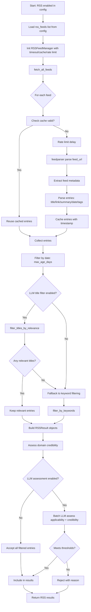

# Newsbot RSS Identification and Analysis Flow

```mermaid
flowchart TD
    A[Start: RSS enabled in config] --> B[Load rss_feeds list from config]
    B --> C[Init RSSFeedManager with timeout/cache/rate limit]
    C --> D[fetch_all_feeds]

    D --> E{For each feed}
    E --> F[Check cache valid?]
    F -->|Yes| G[Reuse cached entries]
    F -->|No| H[Rate limit delay]
    H --> I[feedparser parse feed_url]
    I --> J[Extract feed metadata]
    J --> K[Parse entries: title/link/summary/date/tags]
    K --> L[Cache entries with timestamp]
    G --> M[Collect entries]
    L --> M

    M --> N[Filter by date: max_age_days]
    N --> O{LLM title filter enabled?}
    O -->|Yes| P[filter_titles_by_relevance]
    P --> Q{Any relevant titles?}
    Q -->|Yes| R[Keep relevant entries]
    Q -->|No| S[Fallback to keyword filtering]
    O -->|No| S
    S --> T[filter_by_keywords]
    R --> U[Build RSSResult objects]
    T --> U

    U --> V[Assess domain credibility]
    V --> W{LLM assessment enabled?}
    W -->|No| X[Accept all filtered entries]
    W -->|Yes| Y[Batch LLM assess applicability + credibility]
    Y --> Z{Meets thresholds?}
    Z -->|Yes| AA[Include in results]
    Z -->|No| AB[Reject with reason]
    X --> AA

    AA --> AC[Return RSS results]
    AB --> AC
```
